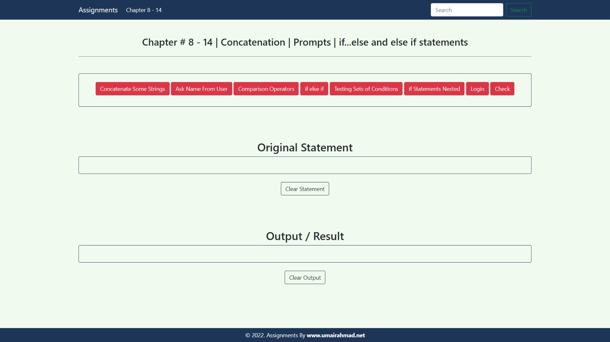

# Assignment 2 - JavaScript Conditionals & Prompts (Chapters 8-14)

## 📚 Overview

This assignment demonstrates key JavaScript concepts from chapters 8-14, focusing on string concatenation, user input with prompts, and conditional logic using `if`, `else if`, and nested `if` statements. It provides an interactive interface to explore how these concepts work in practice.

## 🖼️ Reference Image



*Reference design showing the expected layout of the assignment interface*

This reference image shows the design and layout of the assignment interface, featuring the interactive buttons and display sections for statements and results.

## 🌐 Live Demo

**Live URL:** [https://aman-js2.netlify.app/](https://aman-js2.netlify.app/)

## 📋 Features

The application includes interactive buttons that demonstrate various JavaScript concepts:

1.  **Concatenate Some String** - Joins multiple strings into a single sentence.
2.  **Ask Name From User** - Prompts the user for their name and displays it.
3.  **Comparison Operators** - Shows a list of JavaScript comparison operators.
4.  **if else if** - Assigns a grade based on a user-provided number.
5.  **Testing Sets Of Condition** - Checks multiple conditions (age and weight) using logical operators.
6.  **If Statement Nested** - Demonstrates the use of nested `if` statements.
7.  **Login** - Simulates a simple login check for a username and password.

## 📁 Project Structure

```
Assignment_2/
├── index.html      # Main HTML file with Bootstrap UI
├── script.js       # JavaScript functionality for conditional logic
├── style.css       # Custom styling
└── README.md       # This file
```

## 🛠️ Technologies Used

-   **HTML5** - Structure and markup
-   **CSS3** - Custom styling
-   **JavaScript (ES6+)** - Core functionality and DOM manipulation
-   **Bootstrap 5.3.8** - UI framework for responsive design

## 🚀 Getting Started

### Prerequisites

-   A modern web browser (e.g., Chrome, Firefox, Safari)

### Installation

1.  Clone the repository or download the project files.
2.  Navigate to the `SMIT-Web-and-Mobile-app-development/03_JS/Assignment_2` folder.
3.  Open `index.html` in your web browser to run the assignment.

## 💻 Usage

1.  Click any of the red buttons to execute a JavaScript function related to conditional logic or prompts.
2.  View the **Original Statement** section to see the JavaScript code being executed.
3.  View the **Output / Result** section to see the outcome of the executed code.
4.  Use the **Clear Statement** and **Clear Output** buttons to reset the display areas.

## 📖 JavaScript Concepts Demonstrated

### User Input
- **`prompt()`** - To get input from the user (name, numbers, credentials).

### Conditional Logic
- **`if-else`** and **`else if`** - For making decisions based on user input (e.g., grading).
- **Nested `if` statements** - For handling more complex, multi-level conditions.
- **Comparison Operators** - `==`, `===`, `!=`, `!==`, `>`, `<`, `>=`, `<=`.
- **Logical Operators** - `&&` (AND) for testing multiple conditions simultaneously.

### String Manipulation
- **Concatenation** - Combining strings using the `+` operator.

### DOM Manipulation
-   **Event Listeners** - Using `onclick` to trigger functions when buttons are clicked.
-   **`getElementById`** - To select and interact with specific HTML elements.
-   **`innerHTML`** and **`innerText`** - To dynamically update the content of the page and show results.

## 🎨 Styling

The project uses:
-   **Bootstrap 5.3.8** for a responsive and consistent UI.
-   Custom CSS (`style.css`) for the color scheme and layout adjustments.
-   **Color Palette:** `#1d3557` (dark blue for header/footer) and `#f1faee` (light background).

## 👤 Author

**Rana Abdul Rehman Rauf**

## 📄 License

This project is created as an educational assignment for the SMIT Web and Mobile App Development course.
