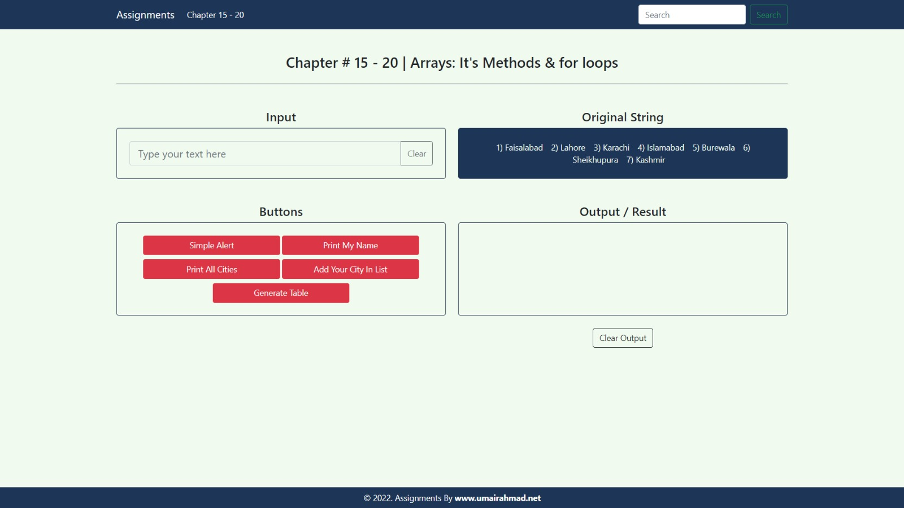

## Assignment 3 - JavaScript Arrays, Loops & DOM (Chapters 15-20)

## 📚 Overview

This assignment demonstrates key JavaScript concepts from chapters 15-20, focusing on **arrays**, **array methods**, **for loops**, and **basic DOM manipulation**.  
It provides an interactive interface with a single input field and multiple buttons to practice updating the page dynamically.

## 🖼️ Reference Image


*Reference design showing the expected layout of the assignment interface (input, buttons, and output areas).*

## 🌐 Live Demo

**Live URL:** [`https://aman-js3.netlify.app/`](https://aman-js3.netlify.app/)

## 📋 Features

The application includes interactive buttons that demonstrate array and loop concepts:

1. **Simple Alert**  
   - Shows a basic browser alert (`"I'm Alert."`).

2. **Print My Name** (`printName()`)  
   - Reads the value from the `inputText` field.  
   - If empty, shows a Toastify error: **“Please Enter Your Name.”**  
   - Otherwise, displays the entered name in the `Output` area.

3. **Print All Cities** (`printAllCities()`)  
   - Uses the `allCities` array: Faisalabad, Lahore, Gujranwala, Sialkot, Islamabad, Kashmir, Multan.  
   - Loops through the array with a `for` loop.  
   - Prints a **numbered list** of all cities in the `Output` area.

4. **Add Your City In List** (`addNewCity()`)  
   - Takes the value from the `inputText` field.  
   - If empty, shows a Toastify error: **“Please Enter city.”**  
   - Otherwise:
     - Shows a green success toast: **“Successfully added”**.  
     - Adds the new city to the `allCities` array with `push()`.  
     - Displays a success message in `Output` with the city name in green.

5. **Generate Table** (`createTable()`)  
   - Reads a number from the `inputText` field.  
   - If empty, shows a Toastify error: **“Please Enter a number.”**  
   - Otherwise, generates a **multiplication table from 1 to 10** for that number and displays it line by line in the `Output` area.

6. **Clear Input / Clear Output**  
   - `clearInput()` empties the `inputText` field.  
   - `clearOutput()` clears the content of the `Output` area.

## 📁 Project Structure

```text
Assignment_3/
├── index.html      # Main HTML file with UI (input, buttons, output)
├── script.js       # JavaScript for arrays, loops, and DOM manipulation
├── style.css       # Custom styling (if used)
├── refrence/       # Reference screenshot for the UI layout
└── README.md       # This file
```

## 🛠️ Technologies Used

- **HTML5** - Structure and markup  
- **CSS3** - Custom styling  
- **JavaScript (ES6+)** - Core functionality, arrays, loops, and DOM updates  
- **Toastify JS** - For toast notifications (error/success messages)  

## 🚀 Getting Started

### Prerequisites

- A modern web browser (e.g., Chrome, Firefox, Edge)

### Installation

1. Clone the repository or download the project files.  
2. Navigate to the `SMIT-Web-and-Mobile-app-development/03_JS/Assignment_3` folder.  
3. Open `index.html` in your web browser to run the assignment.

## 💻 Usage

1. Type a **name**, **city**, or **number** into the `Input` field.  
2. Click one of the buttons (e.g., **Print My Name**, **Print All Cities**, **Add Your City In List**, **Generate Table**).  
3. View the results in the **Output / Result** section.  
4. Use **Clear Input** and **Clear Output** to reset the input field and output area.  

## 📖 JavaScript Concepts Demonstrated

### Arrays & Methods
- Declaration of arrays (`allCities`).  
- Adding elements using **`push()`**.  

### Loops
- **`for` loop** to iterate over the `allCities` array.  
- Generating a multiplication table using a loop from 1 to 10.  

### DOM Manipulation
- **`getElementById`** to select HTML elements.  
- **`innerHTML`** and **`innerText`** to update content dynamically.  
- Button click handlers to trigger functions.

### User Feedback & Validation
- Checking for **empty input** before performing actions.  
- Showing **Toastify** notifications for errors (missing input) and success (city added).

## 👤 Author

**Rana Abdul Rehman Rauf**

## 📄 License

This project is created as an educational assignment for the SMIT Web and Mobile App Development course.
