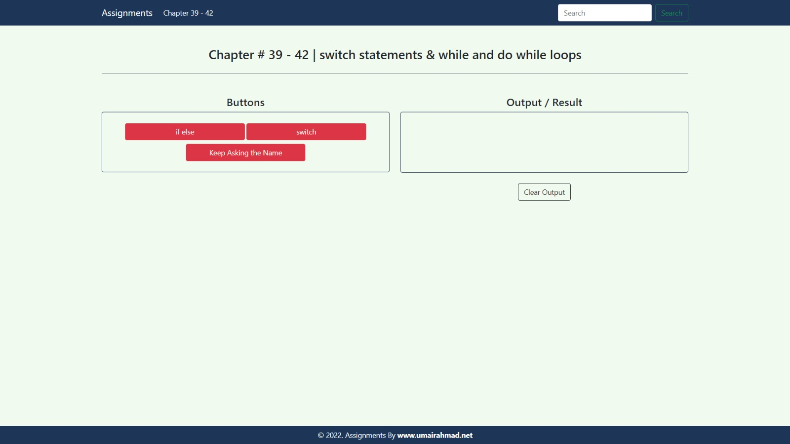

# Assignment 7 - JavaScript Conditionals & Loops (Chapters 39-42)

## 📚 Overview

This assignment focuses on JavaScript control flow concepts from chapters 39-42, specifically **switch statements**, **while loops**, and **do-while loops**. It provides an interactive interface to demonstrate these logic structures in a practical web application.

## 🖼️ Reference Image



_Reference design showing the expected layout and button functionality of the assignment._

## 📋 Features

The application includes interactive buttons that showcase various JavaScript control flow techniques:

1.  **if else** (`ifElse()`)
    - Determines if it's the weekend or a weekday using standard conditional logic.
2.  **switch** (`switchCase()`)
    - Uses a `switch` statement to find the name of the current day based on `new Date().getDay()`.
3.  **Keep Asking the Name** (`keepAsking()`)
    - Implements a `do-while` loop that keeps prompting the user for their name until a valid input is provided or the process is cancelled.

## 📁 Project Structure

```text
Assignment_7/
├── index.html      # Main UI with Bootstrap components
├── script.js       # Core logic for conditionals and loops
├── style.css       # Custom styling and theme adjustments
├── refrence/       # Reference screenshot for the UI layout
└── README.md       # This file
```

## 🛠️ Technologies Used

- **HTML5** - Structure and semantic markup.
- **CSS3** - Custom styling for card layouts and theme consistency.
- **JavaScript (ES6+)** - Switch statements, loops, and DOM manipulation.
- **Bootstrap 5.3.8** - Responsive grid system and UI components.
- **Toastify JS** - Elegant notifications (can be integrated for further validation).

## 🚀 Getting Started

### Prerequisites

- A modern web browser (Chrome, Firefox, Safari, or Edge).

### Installation & Run

1.  Navigate to the `SMIT-Web-and-Mobile-app-development/03_JS/Assignment_7` folder.
2.  Open `index.html` in your web browser.

## 📖 JavaScript Concepts Demonstrated

### Switch Statements

- Handling multiple cases efficiently without deeply nested `if` statements.
- Proper use of `break` and `default`.

### Loops

- **While vs Do-While**: Understanding when to check conditions before or after execution.
- Handling user input dynamically through iterative loops.

## 🎨 Styling

The project maintains the course's signature color palette:

- **Dark Navy** (`#1d3557`): Used for headers, footers, and card borders.
- **Soft Mint** (`#f1faee`): Used for the main background to ensure a clean user interface.

## 👤 Author

**Rana Abdul Rehman Rauf**

## 📄 License

This project is created as an educational assignment for the SMIT Web and Mobile App Development course.

---

**Assignment By:** SMIT - Web and Mobile App Development
